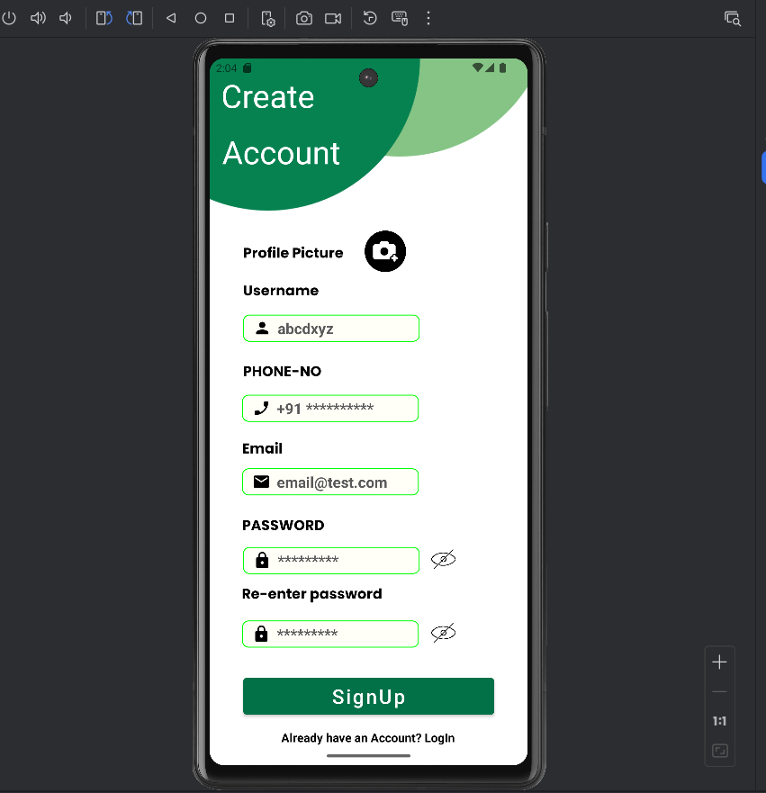
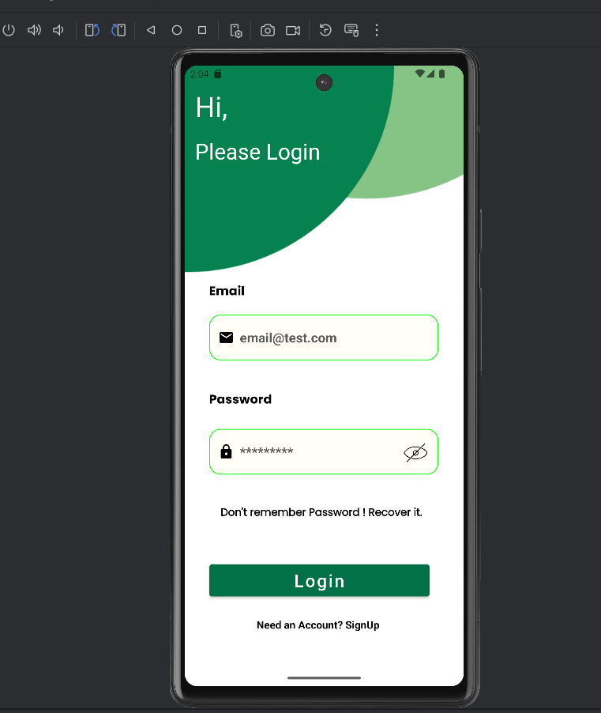

# 💬 Convo-Sphere — Real-Time Chat Application

<p align="center">
  
  
  
  
  
  
</p>

<p align="center">
  A <strong>real-time messaging Android app</strong> built with <strong>Java</strong> and <strong>Firebase Realtime Database</strong> — designed to provide seamless, secure, and instant communication between users with a clean and responsive UI.
</p>

---

## 📸 Screenshots

<p align="center">
  
  
</p>

> 📁 **Note:** Place the screenshot images in a `screenshots/` folder at the root of the repository so they render correctly on GitHub.

---

## ✨ Features

| Feature | Description |
|---|---|
| 🔐 **User Registration** | Create a new account with profile picture, username, phone, email & password |
| 🔑 **Login / Logout** | Secure Firebase Authentication |
| 🔁 **Password Reset** | Reset password via email link |
| 💬 **Real-Time Chat** | Instant messaging via Firebase Realtime Database |
| 👥 **User List** | Browse all registered users to start a conversation |
| 🟢 **Online Status** | See who is currently active |
| 🔔 **Push Notifications** | Firebase Cloud Messaging for new message alerts |
| 📋 **Message History** | Persistent chat history stored in Firebase |
| ⚙️ **Settings Screen** | Manage account and app preferences |
| 🌊 **Splash Screen** | Branded launch screen with auto-login check |

---

## 📂 Full Project File Structure

```
Convo-Sphere/
├── app/
│   ├── src/
│   │   └── main/
│   │       ├── java/com/yourpackage/convosphere/
│   │       │   ├── MainActivity.java                  ← Home screen (user list)
│   │       │   ├── login.java                         ← Login screen
│   │       │   ├── Registration.java                  ← New user registration
│   │       │   ├── ResetPassword.java                 ← Password reset via email
│   │       │   ├── chatwindo.java                     ← Chat window (send/receive messages)
│   │       │   ├── splash.java                        ← Splash/launch screen
│   │       │   ├── SettingActivity.java               ← User settings screen
│   │       │   ├── Users.java                         ← User data model class
│   │       │   ├── msgModelclass.java                 ← Message data model class
│   │       │   ├── messagesAdpter.java                ← RecyclerView adapter for messages
│   │       │   ├── UserAdpter.java                    ← RecyclerView adapter for user list
│   │       │   └── MyFirebaseMessagingService.java    ← FCM push notification handler
│   │       │
│   │       ├── res/
│   │       │   ├── layout/
│   │       │   │   ├── activity_main.xml              ← User list screen layout
│   │       │   │   ├── activity_login.xml             ← Login screen layout
│   │       │   │   ├── activity_registration.xml      ← Registration screen layout
│   │       │   │   ├── activity_reset_password.xml    ← Password reset layout
│   │       │   │   ├── activity_chatwindo.xml         ← Chat window layout
│   │       │   │   ├── activity_splash.xml            ← Splash screen layout
│   │       │   │   ├── activity_setting.xml           ← Settings screen layout
│   │       │   │   ├── sender.xml                     ← Sent message bubble item
│   │       │   │   ├── reciever.xml                   ← Received message bubble item
│   │       │   │   ├── user_item.xml                  ← User list row item
│   │       │   │   └── dialog.xml                     ← Custom dialog layout
│   │       │   └── values/
│   │       │       ├── strings.xml
│   │       │       ├── colors.xml
│   │       │       └── themes.xml
│   │       │
│   │       └── AndroidManifest.xml
│   │
│   ├── google-services.json                           ← Firebase config (you must add this!)
│   └── build.gradle                                   ← App-level Gradle
│
├── screenshots/                                       ← App screenshots for README
│   ├── registrationviewinphone.png
│   └── loginviewinphone.png
│
├── build.gradle                                       ← Project-level Gradle
└── README.md
```

---

## ⚙️ Prerequisites

Make sure you have the following before starting:

- ✅ **Android Studio** — Hedgehog (2023.1.1) or newer  
  👉 [Download Android Studio](https://developer.android.com/studio)
- ✅ **JDK 17** (bundled with Android Studio)
- ✅ **Android SDK** — API Level 21 or higher
- ✅ **Git** — for cloning the repo  
  👉 [Download Git](https://git-scm.com/)
- ✅ **A Google Account** — to create and configure a Firebase project (free)

---

## 🚀 Step-by-Step Setup Guide

### Step 1 — Clone the Repository

Open a terminal and run:

```bash
git clone https://github.com/HelloWorld-Farhan/Convo-Sphere.git
cd Convo-Sphere
```

Or download the ZIP directly:
> Click **Code → Download ZIP** on GitHub → Extract the folder

Alternatively, download the full project source from Google Drive:  
👉 **[Download from Google Drive](https://drive.google.com/file/d/1JQwhlP0-MBekybucXZrhQinG4I1AN3Tw/view?usp=sharing)**

---

### Step 2 — Create a Firebase Project

> ⚠️ This is the **most important step**. Without Firebase, the app will not build or run.

1. Go to 👉 **[https://console.firebase.google.com/](https://console.firebase.google.com/)**
2. Click **"Add project"**
3. Enter a project name (e.g., `ConvoSphere`) and click **Continue**
4. Disable or enable Google Analytics as preferred → Click **Create Project**
5. Wait for the project to be created, then click **Continue**

---

### Step 3 — Register Your Android App in Firebase

1. In the Firebase Console, click the **Android icon** (`</>`) to add an Android app
2. Enter the **package name** — this must exactly match the one in your `AndroidManifest.xml`  
   *(e.g., `com.yourpackage.convosphere`)*
3. Enter a nickname (optional) and click **Register App**
4. Click **"Download google-services.json"**
5. Place the downloaded `google-services.json` file into:

```
Convo-Sphere/
└── app/
    └── google-services.json      ← Place exactly here
```

> ⚠️ **The app will NOT compile without this file.** Never commit it to a public repo.

---

### Step 4 — Enable Firebase Services

#### 🔐 Firebase Authentication

1. In Firebase Console → go to **Build → Authentication**
2. Click **"Get Started"**
3. Under **Sign-in method**, enable **Email/Password**
4. Click **Save**

#### 🗄️ Firebase Realtime Database

1. In Firebase Console → go to **Build → Realtime Database**
2. Click **"Create Database"**
3. Choose your region → Click **Next**
4. Select **"Start in test mode"** for development (allows open read/write)
5. Click **Enable**

> 🔒 **For production**, update the database rules to secure your data:
> ```json
> {
>   "rules": {
>     "users": {
>       "$uid": {
>         ".read": "auth != null",
>         ".write": "auth.uid === $uid"
>       }
>     },
>     "messages": {
>       ".read": "auth != null",
>       ".write": "auth != null"
>     }
>   }
> }
> ```

#### 🔔 Firebase Cloud Messaging (Push Notifications)

FCM is enabled by default when you create a Firebase project. No additional setup is required in the console for basic notification support.

---

### Step 5 — Open the Project in Android Studio

1. Launch **Android Studio**
2. Click **"Open"** (or `File → Open`)
3. Navigate to the cloned `Convo-Sphere` folder → Click **OK**
4. Wait for **Gradle sync** to complete (this may take a few minutes the first time)

---

### Step 6 — Add Gradle Dependencies

#### Project-level `build.gradle` (root)

```groovy
buildscript {
    repositories {
        google()
        mavenCentral()
    }
    dependencies {
        classpath 'com.android.tools.build:gradle:8.3.0'
        classpath 'com.google.gms:google-services:4.4.1'   // ← Required for Firebase
    }
}
```

#### App-level `app/build.gradle`

Plugins block at the top:

```groovy
plugins {
    id 'com.android.application'
    id 'com.google.gms.google-services'    // ← Required for Firebase
}
```

Dependencies block:

```groovy
dependencies {
    implementation 'androidx.appcompat:appcompat:1.7.0'
    implementation 'com.google.android.material:material:1.12.0'
    implementation 'androidx.constraintlayout:constraintlayout:2.2.1'

    // Firebase BoM — manages all Firebase library versions automatically
    implementation platform('com.google.firebase:firebase-bom:33.1.0')

    // Firebase Authentication — login, register, password reset
    implementation 'com.google.firebase:firebase-auth'

    // Firebase Realtime Database — real-time message sync
    implementation 'com.google.firebase:firebase-database'

    // Firebase Storage — for profile picture uploads
    implementation 'com.google.firebase:firebase-storage'

    // Firebase Cloud Messaging — push notifications
    implementation 'com.google.firebase:firebase-messaging'

    // Glide — for loading user profile images
    implementation 'com.github.bumptech.glide:glide:4.16.0'
    annotationProcessor 'com.github.bumptech.glide:compiler:4.16.0'

    // CircleImageView — for round profile pictures
    implementation 'de.hdodenhof:circleimageview:3.1.0'

    // Unit & UI Testing
    testImplementation 'junit:junit:4.13.2'
    androidTestImplementation 'androidx.test.ext:junit:1.2.1'
    androidTestImplementation 'androidx.test.espresso:espresso-core:3.6.1'
}
```

After making changes, click **"Sync Now"** in the top-right banner.

---

### Step 7 — Verify AndroidManifest Permissions

Open `AndroidManifest.xml` and confirm these are present:

```xml
<!-- Internet access for Firebase sync -->
<uses-permission android:name="android.permission.INTERNET" />

<!-- Check network state before sending messages -->
<uses-permission android:name="android.permission.ACCESS_NETWORK_STATE" />

<!-- For reading/storing profile images (Android 12 and below) -->
<uses-permission android:name="android.permission.READ_EXTERNAL_STORAGE" />

<!-- For Firebase Cloud Messaging on Android 13+ -->
<uses-permission android:name="android.permission.POST_NOTIFICATIONS" />
```

Also ensure `MyFirebaseMessagingService` is declared inside `<application>`:

```xml
<service
    android:name=".MyFirebaseMessagingService"
    android:exported="false">
    <intent-filter>
        <action android:name="com.google.firebase.MESSAGING_EVENT" />
    </intent-filter>
</service>
```

---

### Step 8 — Build & Run the App

#### Option A — Run on a Physical Device (Recommended)

1. Enable **Developer Options** on your phone:
   - `Settings → About Phone` → Tap **Build Number** 7 times
   - `Settings → Developer Options` → Enable **USB Debugging**
2. Connect your phone via USB
3. Select your device from the device dropdown in Android Studio
4. Click ▶️ **Run** (or press `Shift + F10`)
5. Grant all requested permissions when prompted

#### Option B — Run on an Emulator

1. Open **Device Manager** in Android Studio
2. Create a virtual device: **Pixel 6**, **API 33+**
3. Start the emulator
4. Click ▶️ **Run**

---

## 📲 App Flow & Screen Navigation

```
splash.java (Launch)
      ↓
   [Checks if user is already logged in]
      ├── Already logged in  →  MainActivity.java (User List)
      └── Not logged in      →  login.java
                                    ├── New user?           →  Registration.java
                                    │      └── Enter: Profile Picture, Username,
                                    │               Phone, Email, Password → SignUp
                                    └── Forgot password?    →  ResetPassword.java
                                              ↓
                                    MainActivity.java (User List)
                                          ↓ Tap any user
                                    chatwindo.java (Real-Time Chat Window)
                                          ↑
                                    SettingActivity.java (Profile & Settings)
```

---

## 🗄️ Firebase Realtime Database Structure

```json
{
  "users": {
    "USER_UID_1": {
      "name": "Farhan Khalid",
      "email": "farhankhalid17968@gmail.com",
      "phone": "+91XXXXXXXXXX",
      "profileImage": "https://...",
      "status": "online"
    }
  },
  "messages": {
    "SENDER_UID_RECEIVER_UID": {
      "MESSAGE_ID_1": {
        "message": "Hello!",
        "senderId": "USER_UID_1",
        "timestamp": 1700000000000
      }
    }
  }
}
```

---

## 🔧 Troubleshooting

### ❌ `google-services.json` Not Found / Build Fails

- Make sure `google-services.json` is inside the `app/` folder (NOT the project root)
- Confirm the package name in the JSON matches your `AndroidManifest.xml` exactly
- Do a clean rebuild: `Build → Clean Project` → `Build → Rebuild Project`

### ❌ Gradle Sync Fails

- Go to `File → Invalidate Caches → Invalidate and Restart`
- Ensure you have a stable internet connection
- Make sure `id 'com.google.gms.google-services'` is in `app/build.gradle` plugins block

### ❌ Messages Not Appearing in Real Time

- Confirm **Firebase Realtime Database** is enabled in your Firebase Console
- Check that your database rules allow read/write (`"test mode"` during development)
- Confirm `INTERNET` permission is in `AndroidManifest.xml`

### ❌ Login / Registration Not Working

- Confirm **Email/Password** sign-in is enabled in Firebase → Authentication → Sign-in method
- Check that the email format is valid (e.g., `user@example.com`)
- Make sure passwords match and meet minimum length (6 characters)

### ❌ Push Notifications Not Received

- Make sure `MyFirebaseMessagingService` is declared in `AndroidManifest.xml`
- On Android 13+, the app must request `POST_NOTIFICATIONS` permission at runtime
- Test using **Firebase Console → Messaging → Send test message**

### ❌ Profile Images Not Loading

- Confirm Glide dependency is in `build.gradle`
- Confirm Firebase Storage rules allow read access
- Check internet permission in manifest

---

## 🛠️ Tech Stack

| Component | Library / Tool |
|---|---|
| Language | Java |
| Backend / Database | Firebase Realtime Database |
| Authentication | Firebase Authentication |
| Push Notifications | Firebase Cloud Messaging (FCM) |
| File Storage | Firebase Storage |
| Image Loading | Glide 4.16.0 |
| Profile Image View | CircleImageView 3.1.0 |
| UI Framework | Material Design 3 |
| Min SDK | API 21 (Android 5.0) |
| Target SDK | API 34 (Android 14) |

---

## 📋 Permissions Summary

| Permission | Why It's Needed |
|---|---|
| `INTERNET` | Firebase real-time sync and messaging |
| `ACCESS_NETWORK_STATE` | Detect connectivity before sending |
| `READ_EXTERNAL_STORAGE` | Profile image selection from gallery |
| `POST_NOTIFICATIONS` | Push notification display (Android 13+) |

---

## 👨‍💻 Author

**Farhan Khalid** — Android Developer  
📧 farhankhalid17968@gmail.com  
🔗 [LinkedIn](https://www.linkedin.com/in/farhan-khalid-117514259/)  
🐙 [GitHub](https://github.com/HelloWorld-Farhan)

---

## 📄 License

```
MIT License

Copyright (c) 2026 Farhan Khalid

Permission is hereby granted, free of charge, to any person obtaining a copy
of this software and associated documentation files (the "Software"), to deal
in the Software without restriction, including without limitation the rights
to use, copy, modify, merge, publish, distribute, sublicense, and/or sell
copies of the Software, and to permit persons to whom the Software is furnished
to do so, subject to the following conditions:

The above copyright notice and this permission notice shall be included in all
copies or substantial portions of the Software.

THE SOFTWARE IS PROVIDED "AS IS", WITHOUT WARRANTY OF ANY KIND, EXPRESS OR
IMPLIED, INCLUDING BUT NOT LIMITED TO THE WARRANTIES OF MERCHANTABILITY,
FITNESS FOR A PARTICULAR PURPOSE AND NONINFRINGEMENT.
```

---

## 🌟 Star This Repo

If you found this project helpful, consider giving it a ⭐ on GitHub!

---

<p align="center">Made with ❤️ in India — Fast, real-time, and secure messaging for everyone</p>
